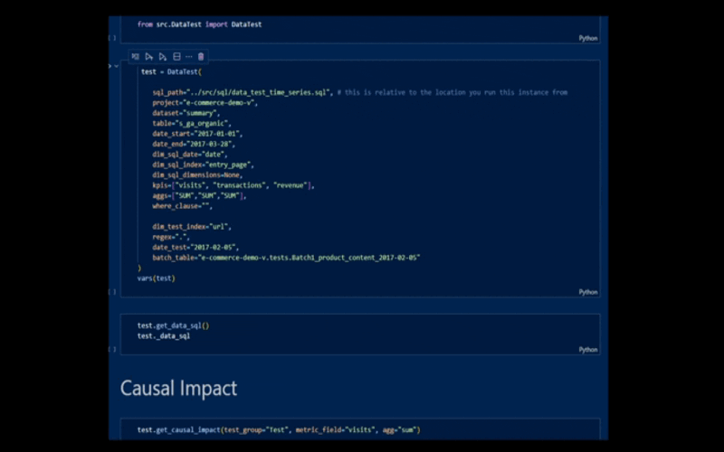
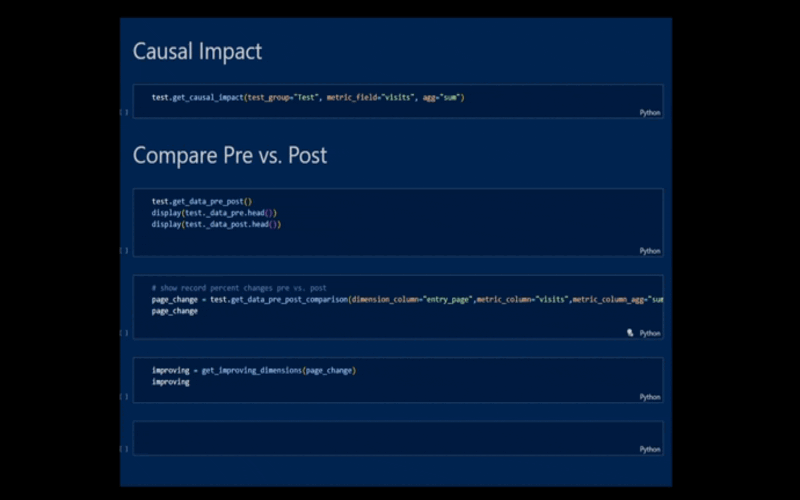
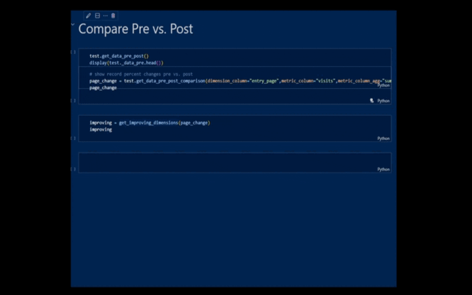

# A Data Structure for Analysts

This repository offers an object-oriented framework analysts can leverage to efficiently explore and explain data. 

Three approaches in this repository offer modular and scalable additions to data-centric methods/algorithms.

1. data initialization using your dynamically inserted sql populated by class arguments in a Class object
2. algorithmic methods found in themed python files that can be imported into the Class object 
3. subclasses that make use of the Data class' inheritance while allowing for task oriented objects like tests

The Data object exists in this `/src` directory which lives within the following folder structure:


```
.
 |-.env
 |-.gitignore
 |-docs
 |-LICENSE
 |-README.md
 |-requirements.txt
 |-secret.json
 |-src
 | |-config.py
 | |-Data.py
 | |-DataCompare.py
 | |-DataTest.py
 | |-DataTrend.py
 | |-logic.py
 | |-sql
 | | |-data_categorical.sql
 | | |-data_pre_post.sql
 | | |-data_table.sql
 | | |-data_test_time_series.sql
 | | |-data_time_series.sql
 | | |-data_time_series_distinct_date.sql
 | | |-data_time_series_distinct_index.sql
 | |-trend.py
 | |-__init__.py
 |-tests
 | |-demo_Data.ipynb
 | |-demo_DataTest.ipynb
 | |-demo_DataTrend.ipynb
```


## Insert Variables into Templatized SQL

A recommended step before using this class involves creating a star-schema data warehouse.

Follow my [Analyst Data Warehouse](https://github.com/VanAltrades/analyst-data-warehouse) tutorial for an indepth walkthrough on how to create a data warehouse capable of storing metric and dimensional data that's use could range from Wall Street to the Kennedy Space Center.

Analysts can deal with a number of requests and work becomes duplicative and time-wasting when insight requires formatting a .sql query from your data warehouse, loading the response in an environment for exploration, and performing tasks and leveraging algorithms to answer questions.

This repository accounts for these steps and offers an object oriented approch to insight.

The Data class takes sql path and sql variable arguments.

You are free to define your own sql and store it in the `/sql` directory.

By storing your sql like so...

```
SELECT
    {_dim_sql_date}
    {_dim_sql_index}
    {_dim_sql_dimensions}
    {_kpi_aggregates}

FROM 
    `{_project}.{_dataset}.{_table}` facts

WHERE 
    date BETWEEN "{_date_start}" AND "{_date_end}"
    {_where_clause}
    {_group_by_clause}
```
... you can take advantage of the Data class' sql formatting which dynamically inserts multiple arguments into a properly formatted sql script.

With this flexible framework, you can save time instatiating data to explore.

With your arguments defined, simply run `Data._get_data_sql()` to store a dataframe instance variable named `Data._data_sql`

I recommend saving themed sql file. Routine data structures to explore will likely be *categorical* or *time-series* in nature. Explore the `/sql` directory to view examples of each.

## Instantly Show Trends

The `trends.py` file offers class instance methods to visualize your datas trends over time.

Before running `get_trend_x()` functions included in the script, format your data using the `format_data_for_plotly()` method which updates `Data._data_sql`.


## Configure Your Testing Suite

The DataTest.py file contains a subclass of Data which allows you to leverage testing algorithms to report on your own implementations.

Additional arguments include...

```
self._dim_test_index=dim_test_index    # "url"
self._regex=regex                      # 'item[0-9_.+-]+'
self._date_test=date_test              # "2017-02-05"
self._batch_tbl=batch_table            # "e-commerce-demo-v.tests.Batch1_product_content_2017-02-05"

```

... which define how you will join a test group to your summary data.

In this e-commerce example, a test group should contain the following fields in a table to track changes using this Class...

```
	
url	        STRING	NULLABLE				
id	        INTEGER	NULLABLE				
test_batch	INTEGER	NULLABLE				
test_group	STRING	NULLABLE				
test_date	STRING	NULLABLE		
```



With the DataTest class instantiated, you can leverage a number of algorithms to report on changes as you deem fit.

* causal impact:             COMPLETE
* synthetic control:         TODO
* difference in difference:  TODO


And other methods exist to further describe and explore your data by dimensions and metrics.



### TODO:

* test outlier identification
* test time estimate to significance